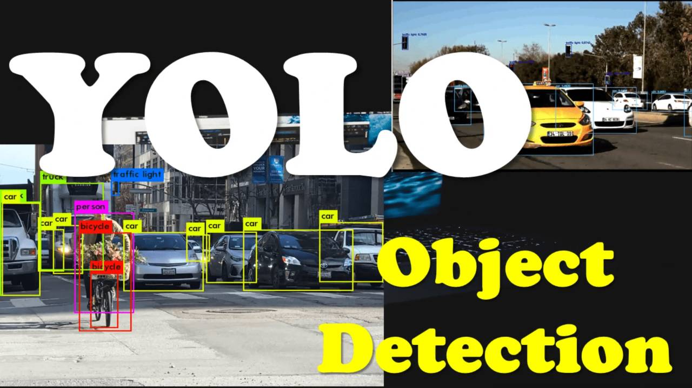
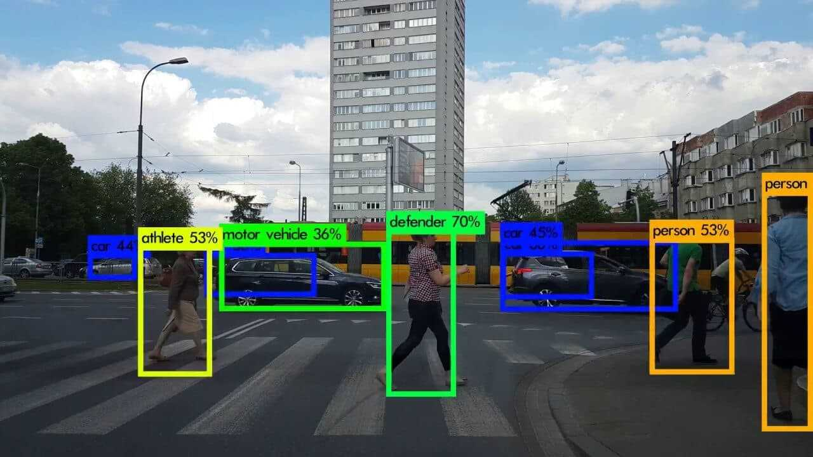

# Object Detection for Images and Videos

     
     
</p

## Overview
This project presents a comprehensive object detection system designed to identify and localize multiple objects in both static images and video streams. The system leverages deep learning techniques to perform accurate detection, classification, and localization in real time or from stored media.

Object detection is a core task in computer vision and is widely applied in domains such as surveillance, autonomous systems, healthcare, and intelligent analytics.

## Objectives
Detect and classify objects in images and video streams  
Accurately localize objects using bounding boxes  
Enable real time detection with efficient processing  
Support detection of multiple object classes  
Provide a scalable and modular implementation  

## Key Features
Multi object detection within a single frame  
Real time video processing using webcam or video files  
Bounding box visualization with confidence scores  
Integration with pretrained models such as YOLO  
Support for custom dataset training  
Optimized detection speed and accuracy  
Modular and maintainable code structure  

## Technologies Used
Programming Language  
Python  

Libraries and Frameworks  
OpenCV for image and video processing  
PyTorch or TensorFlow for deep learning  
NumPy for numerical computations  
Matplotlib for visualization  

Model Architecture  
YOLO for real time object detection  

## System Architecture

### Input Layer
Accepts input in the form of image files or video streams including webcam input  

### Preprocessing
Resizes images and normalizes pixel values  
Extracts frames from video inputs  

### Detection Model
Processes input data using a deep learning model  
Outputs bounding boxes class probabilities and confidence scores  

### Post Processing
Applies Non Maximum Suppression to remove redundant detections  
Filters predictions based on confidence thresholds  

### Output Layer
Generates annotated images or video frames with bounding boxes and class labels  

## How It Works
The system uses a single stage object detection model that divides an image into a grid and predicts bounding boxes and class probabilities simultaneously. This approach enables faster detection compared to traditional multi stage models.

For video processing each frame is extracted and passed through the detection model. The predictions are drawn on each frame and combined to produce an output video stream.

## Performance Metrics
Mean Average Precision measures detection accuracy  
Intersection over Union evaluates bounding box overlap  
Frames Per Second measures processing speed  
Precision and Recall evaluate classification performance  

## Use Cases
Autonomous driving systems  
Retail analytics and customer behavior tracking  
Surveillance and security monitoring  
Medical image analysis  
Agricultural monitoring  

## Challenges and Limitations
Performance may degrade in low light conditions  
High computational requirements for real time inference  
Model accuracy depends on dataset quality  

## Author
Kamau Johnson
